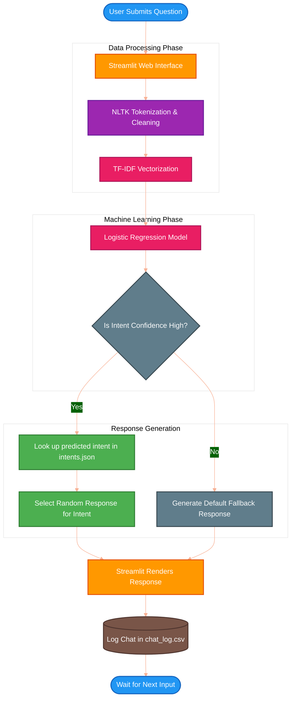

# Complete Project Documentation: Financial Literacy Chatbot

<div align="center">
  <h3>Developed By</h3>
  <h2><b>HARSH KUMAR</b></h2>
  <h3>Registration Number: <b>250301120321</b></h3>
  <br>
  <h2>🚀 <a href="https://hkumar7794-financial-literacy-chatbot2-app-f6ipgp.streamlit.app/" target="_blank">Live Project Link</a> 🚀</h2>
</div>

---

## 1. Project Overview & Problem Statement
### The Problem
Financial literacy is a critical life skill, yet many individuals struggle with basic financial concepts such as budgeting, saving, investing, tax planning, and debt management. This lack of accessible, personalized, and easy-to-understand financial education often leads to poor financial decision-making and long-term economic instability.

### The Solution
The **Financial Literacy Chatbot** aims to bridge this knowledge gap. It is an intelligent, conversational AI assistant designed to provide users with instant, reliable, and easy-to-understand guidance on various personal finance topics. By utilizing Natural Language Processing (NLP) and Machine Learning (ML), the chatbot interprets user questions and maps them to the most accurate financial advice.

---

## 2. Project Objectives
1. **Interactive Education**: Create a user-friendly conversational interface to answer finance-related queries.
2. **Intent Recognition**: Accurately understand what the user is asking, regardless of the phrasing.
3. **Continuous Access**: Deploy the application on a cloud platform (Streamlit) so it is accessible 24/7.
4. **History Tracking**: Maintain a log of user interactions to analyze frequently asked questions and improve the bot over time.

---

## 3. Technology Stack 🛠️

| Component | Technology Used | Purpose |
| :--- | :--- | :--- |
| **Programming Language** | Python 3.11 | Core logic, data processing, and ML modeling. |
| **Frontend Framework** | Streamlit | Rapid development of the web-based Graphical User Interface (GUI). |
| **NLP Library** | NLTK (Natural Language Toolkit) | Tokenizing text, breaking down user input into analyzable words. |
| **Machine Learning** | Scikit-Learn | Training the AI. Uses `TfidfVectorizer` for text-to-number conversion and `LogisticRegression` for classification. |
| **Data Storage** | JSON & CSV | `intents.json` acts as the brain/database for Q&A. `chat_log.csv` stores user chat histories. |
| **Deployment Platform** | Streamlit Community Cloud | Hosting the live web application. |

---

## 4. System Architecture & Workflow Diagram 📊

The following diagram illustrates the complete step-by-step data flow of the application, from the moment a user types a message to the moment the chatbot replies.



---

## 5. Step-by-Step Implementation Details

### Step 5.1: Data Collection (`intents.json`)
The foundational dataset of the chatbot is stored in a JSON file. This file contains a list of "intents" (topics). Each intent contains:
*   **Tags**: A unique identifier for the topic (e.g., `budgeting`, `investing`).
*   **Patterns**: Various ways a user might ask about this topic. (e.g., "How do I save money?", "Tips for budgeting").
*   **Responses**: A list of pre-defined, helpful answers.

### Step 5.2: Natural Language Processing (NLTK)
When the user types a message, computers cannot instantly understand the text. **NLTK (Natural Language Toolkit)** is used to perform *Tokenization*. This process breaks the user's sentence down into individual words and strips away unnecessary punctuation, allowing the AI to focus on keywords.

### Step 5.3: Feature Extraction (TF-IDF Vectorizer)
Machine Learning models require numbers, not words. The **Term Frequency-Inverse Document Frequency (TF-IDF)** vectorizer transforms the text data into mathematical vectors. 
*   **Term Frequency (TF)** counts how often a word appears.
*   **Inverse Document Frequency (IDF)** lowers the weight of very common words (like "the", "is") and highlights unique, meaningful words (like "tax", "stock").

### Step 5.4: Machine Learning Model (Logistic Regression)
Once the text is converted to numbers, it is fed into a **Logistic Regression** model provided by `scikit-learn`. 
During the startup phase, the model is trained on all the patterns inside `intents.json`. When a live user asks a question, the model calculates the probability of the question belonging to each specific intent category and outputs the highest matching tag.

### Step 5.5: Building the GUI (Streamlit)
**Streamlit** is used to create the frontend without needing HTML, CSS, or JavaScript. 
*   It utilizes `st.text_input` to capture the user's message.
*   It renders the conversation using visually appealing chat bubbles.
*   A sidebar is created to allow users to view their past conversation logs.

### Step 5.6: Logging & Auditing (`chat_log.csv`)
For record-keeping, every user message and corresponding bot reply, along with a timestamp, is appended to `chat_log.csv` using Python's built-in `csv` module. This allows the system administrator to review logs and continuously add new patterns to `intents.json` if the bot failed to understand a specific query.

---

## 6. How to Run Locally 💻

To test or modify this project on your local machine, follow these precise steps:

1. **Clone the Repository:**
   ```bash
   git clone https://github.com/hkumar7794/financial-literacy-chatbot2.git
   cd financial-literacy-chatbot2
   ```

2. **Install Python & Dependencies:**
   Ensure Python 3 is installed. Then, install the required packages:
   ```bash
   pip install -r requirements.txt
   ```

3. **Run the Application:**
   ```bash
   streamlit run app.py
   ```
   The browser will automatically open to `http://localhost:8501`.

---

## 7. Conclusion & Future Scope
The **Financial Literacy Chatbot** successfully demonstrates how Natural Language Processing and simple Machine Learning classification can be combined to solve real-world educational problems.

### Future Enhancements:
*   **API Integration**: Connecting to live stock market APIs to provide real-time financial data.
*   **Advanced LLMs**: Upgrading from Logistic Regression to advanced Transformer models (like OpenAI GPT or Llama) for more dynamic, generative responses instead of static pre-defined text.
*   **Voice Input**: Adding Speech-to-Text capabilities for easier mobile usage.
