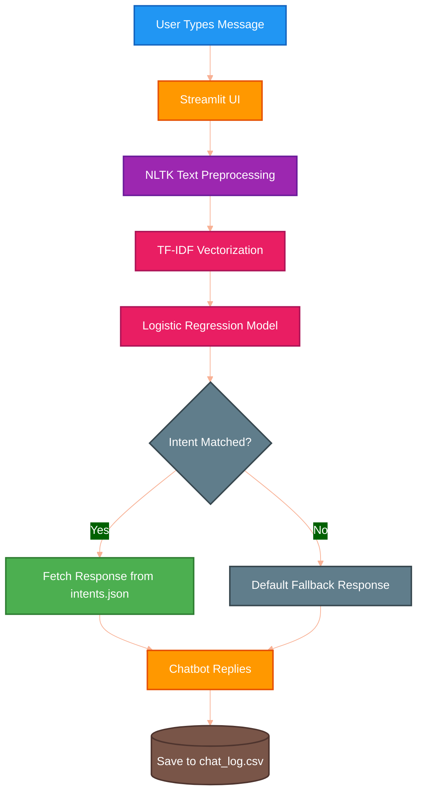
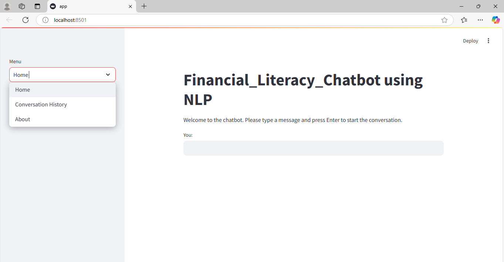

<div align="center">

# $\textsf{\color{#FF5733}{\Huge HARSH KUMAR}}$
# $\textsf{\color{#33C1FF}{\Huge REG NO: 250301120321}}$

</div>

<br>

# Financial Literacy Chatbot 🤖💰

## Problem Statement
Many individuals struggle with basic financial concepts such as budgeting, saving, investing, and debt management. The lack of accessible, personalized, and easy-to-understand financial education leads to poor financial decision-making. 
The **Financial Literacy Chatbot** aims to bridge this gap by providing an intuitive, conversational interface where users can ask questions and receive instant, reliable guidance on various personal finance topics.

## Tech Stack 🛠️
- **Frontend / UI**: [Streamlit](https://streamlit.io/) - Used for building the interactive web-based chat interface.
- **Language / Logic**: Python 3.11
- **Natural Language Processing (NLP)**: [NLTK](https://www.nltk.org/) (Natural Language Toolkit) - Used for tokenizing text and processing user inputs.
- **Machine Learning / AI**: [Scikit-learn](https://scikit-learn.org/) 
  - *TF-IDF Vectorizer*: Converts user text into meaningful numeric features.
  - *Logistic Regression*: Classifies the user's input into predefined intent categories.
- **Data Storage**: JSON (`intents.json`) - Stores the training phrases, intents, and corresponding chatbot responses. CSV (`chat_log.csv`) - Logs user chat history.

## Workflow & Architecture Diagram 📊

The system workflow handles processing user input, predicting the intent, and outputting the best response. 



### Workflow Details Step-by-Step
1. **User Interaction**: The user enters a finance-related question on the Streamlit web interface.
2. **Text Preprocessing**: The raw text is passed to NLTK, which tokenizes and cleans the text data.
3. **Feature Extraction**: Scikit-Learn's `TfidfVectorizer` transforms the text into numerical vectors that the ML model can understand.
4. **Intent Classification**: A trained `LogisticRegression` model analyzes the vector and predicts the most likely "intent" (e.g., asking about budgets, investments, etc.).
5. **Response Generation**: The system looks up the predicted intent in `intents.json` and randomly selects an appropriate response.
6. **Logging**: The conversation is saved locally in `chat_log.csv` for future auditing or context tracking.

## Step-by-Step Setup Guide 🚀

Follow these steps to run the project on your local machine:

**Step 1: Clone the Repository**
```bash
git clone https://github.com/hkumar7794/financial-literacy-chatbot2.git
cd financial-literacy-chatbot2
```

**Step 2: Install Python**
Ensure you have Python 3 installed. You can download it from [python.org](https://www.python.org/downloads/). *(Make sure to add Python to your system PATH).*

**Step 3: Install Dependencies**
Install all required libraries using `pip`:
```bash
pip install -r requirements.txt
```

**Step 4: Run the Application**
Start the Streamlit server:
```bash
streamlit run app.py
```

**Step 5: Chat!**
Your browser should automatically open `http://localhost:8501`. If not, click the link in your terminal to start interacting with the chatbot!

## Project Preview

